## New map: **Ancient Forest** in the **Umbraa** region

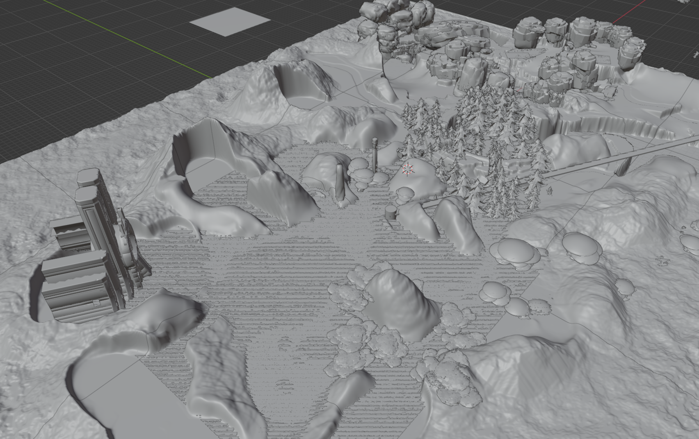 

<video src="./ancient-forest-walkthrough.mov" controls></video>

### How big is the map exactly? Let's get a sense of scale.

<video src="./ancient-forest-scale.mov" controls></video>

### Here's how it compares to the working draft of a map from the game files:

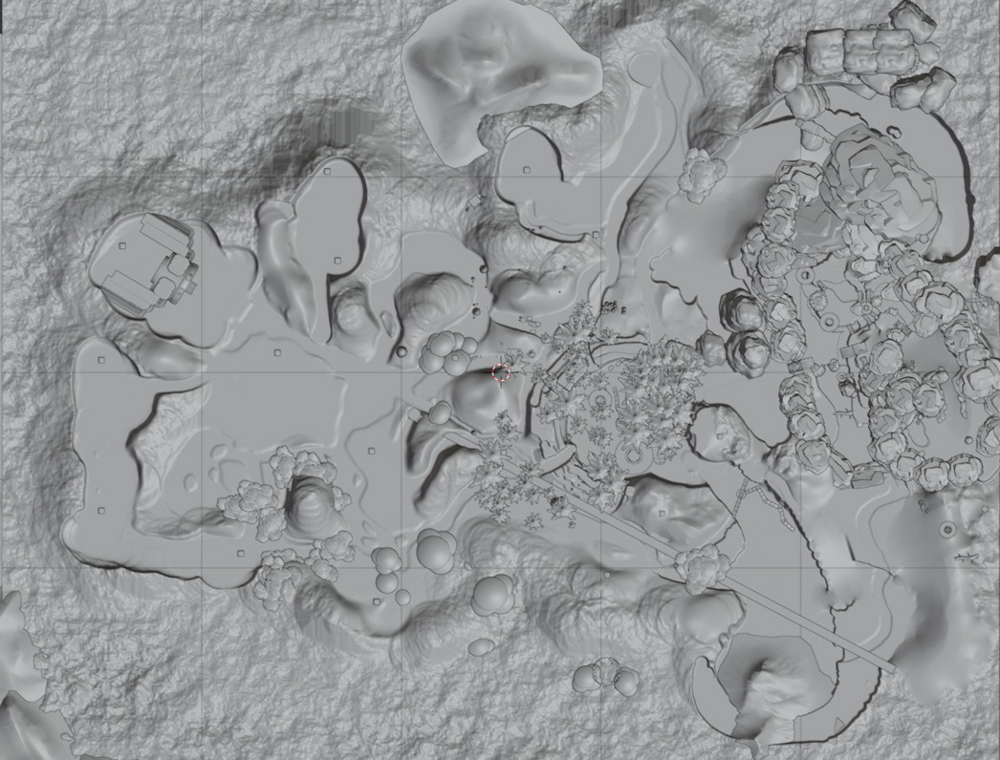 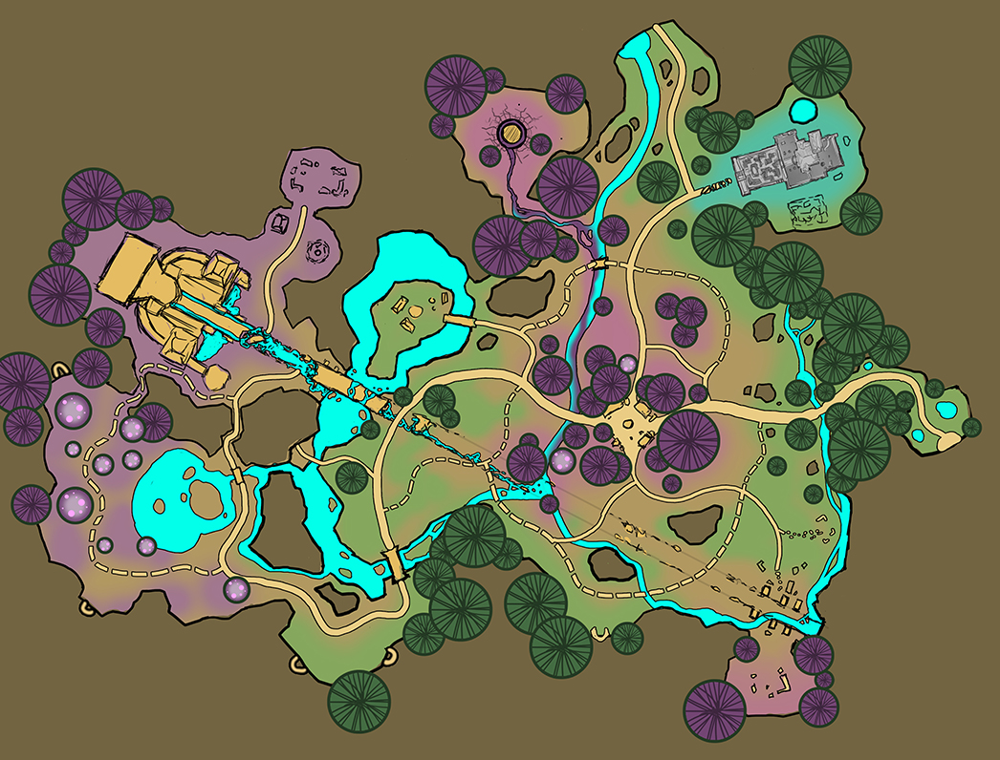 

---

### ...new ore: **Illuminium**

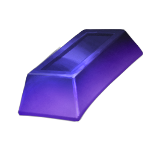 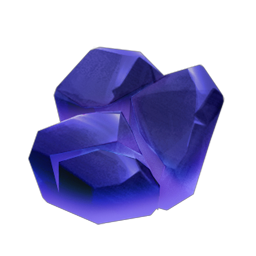

### ...a bunch of new fish, bugs and forage

- Forage
  - Elderflower
  - Elderwood Lotus
  - Elderwood Orchid
  - Fern Fiddlehead
  - Kopaa bush
  - Waterflower
  - FLOWTATO 😂
  - Mushrooms
    - Floatfish mushroom
	- Baby clam, Elder clam shroom
	- Staircase mushroom
  - Black pearl
  - Beehive and Honey

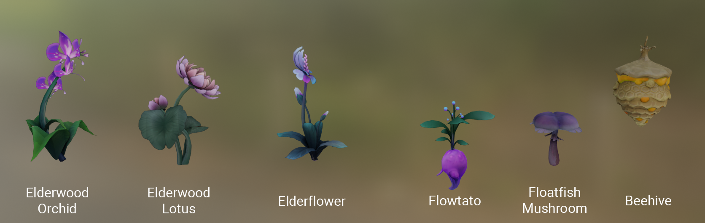

- Bugs
  - Butterfly: Dayshadow butterfly, Moth Kitsuu, Cottonhop butterfly, Vampire butterfly,
  - Beetle: Blood beetle, Banshee beetle, Draugr beetle, Shadvaraak
  - Moth: Hummingbird moth, Whispering Widow, Witch's Eye
  - **Piksii**: Brightshroom piksii, Flame piksii, Zephyr piksii, 
  - Grasshopper: Flamehorned rockhopper, Floating Lantern rockhopper, Grumpy Granite rockhopper, Pumpkin rockhopper,
  - ...and more

- Fish
  - Gouramis Grim, 
Sabertoothed anchvoy, Elderwood betta, Halfmoon betta, Umbraan betta, Flounder Fluttering, Nova Bitterling, Ancient Eel, Lightrail, Majiri of War, Midnight floatfish, Moon floatfish, Piksii floatfish, Toadstool floatfish, Umbraan floatfish, Dappled Discus, Frillyfin, Ancient Koi, 
Brightshroom Oranda, Inyrevn Mermaid, Mullet Minnow...
  - **Sharks**: Elder shark, River shark
  - ...and more

- Hunting: **Fungopher**

---

## Earth temple: **Vault of the Roots**

<video src="./earth-temple.mov" controls></video>

### Earth bundle

**Reward: Ancient Galdur Statue** (GaldurSeedMaker)

> This bears the face of a familiar friend. At least this version is less talkative... for now

- Prospector’s Pal Bundle (**reward: Phoenix Flooring**)
  - Emerald
  - Jasper
  - Gold Bar (3)
  - Palium bar (20)

- Creatures of the Abyss Bundle (**reward: Galdur Bobber**)
  - Stonefish
  - Hypnotic Moray
  - Ancient Amber Beetle
  - Leafstalker Mantis

- Fruits of the Earth Bundle (**reward: recipe - Stuffed Tomatoes**)
  - Muujin Bahari
  - Bacon-Stuffed Mushrooms
  - Apple (100)
  - Brightshroom (20)

- Rootseeker's Bundle (**reward: recipe - Phoenix Floor Planter**)
  - Rootseeker Medallion (6)

### Ancient Galdur Statue ("Galdur seed maker")

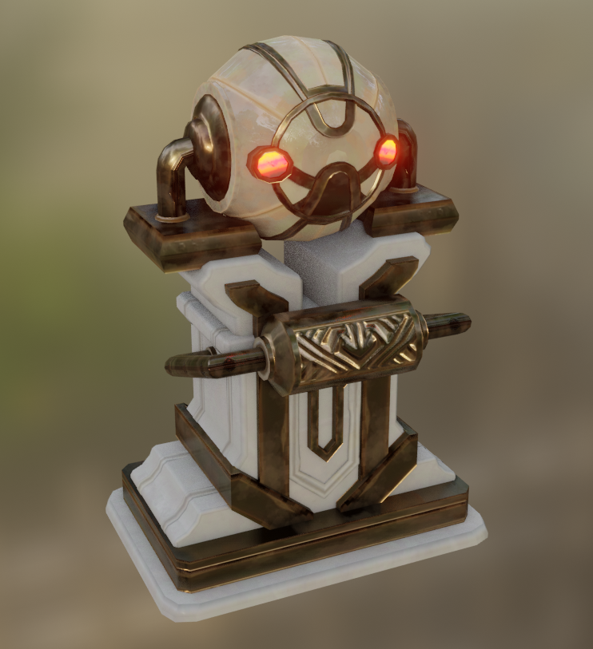 

### Galdur bobber

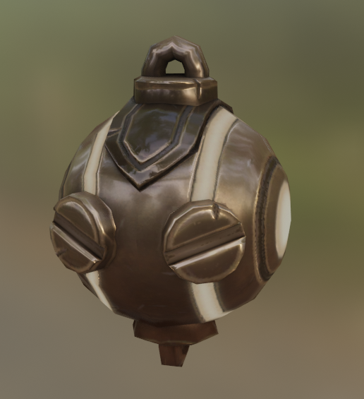 

---

## New NPC: **Ulfe**

### Also known as "the Umbraan child", "lost child".

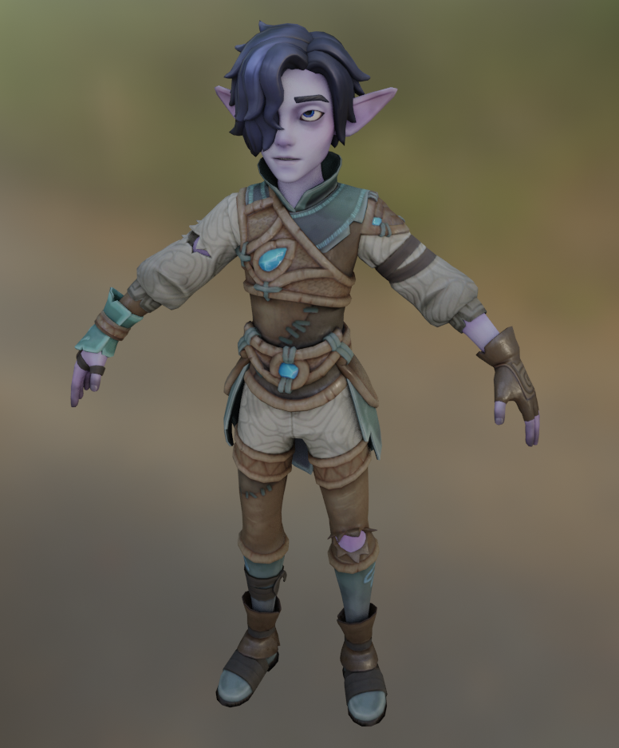 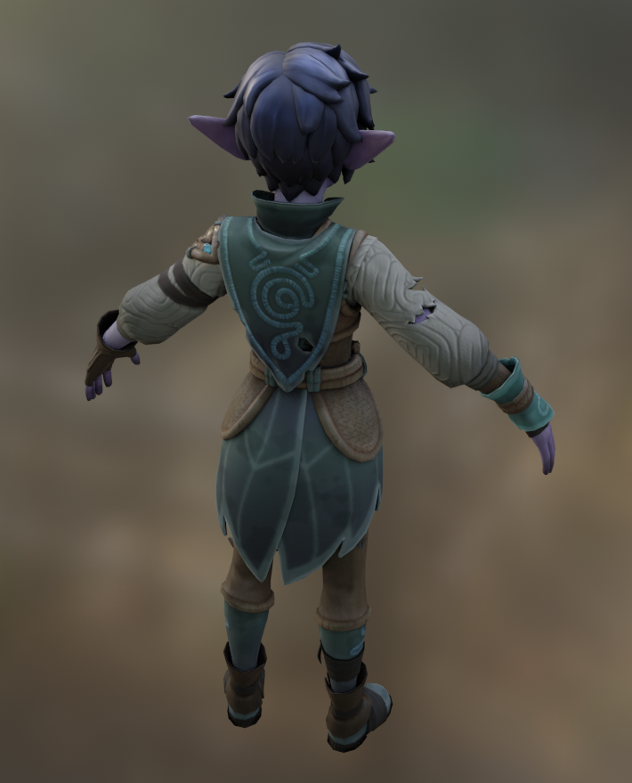 

---

## Housing addons

### Courtyard

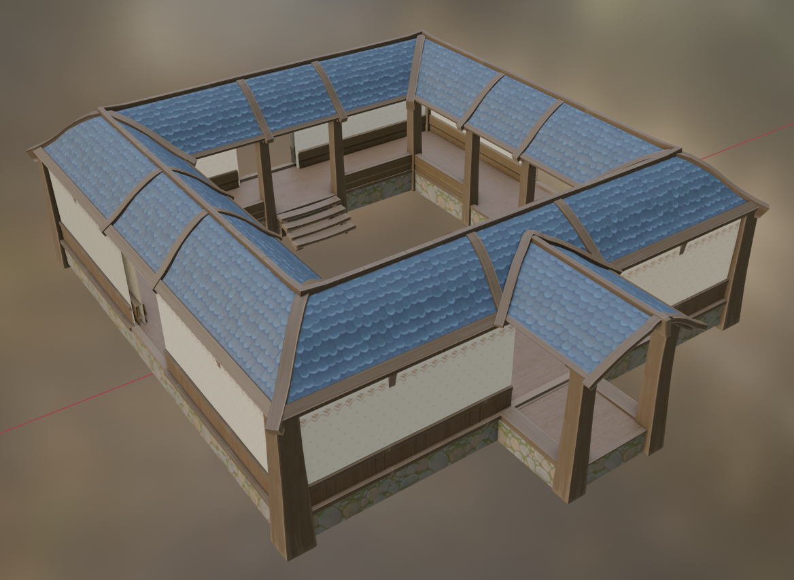

### Dormer window (goes on the roof)

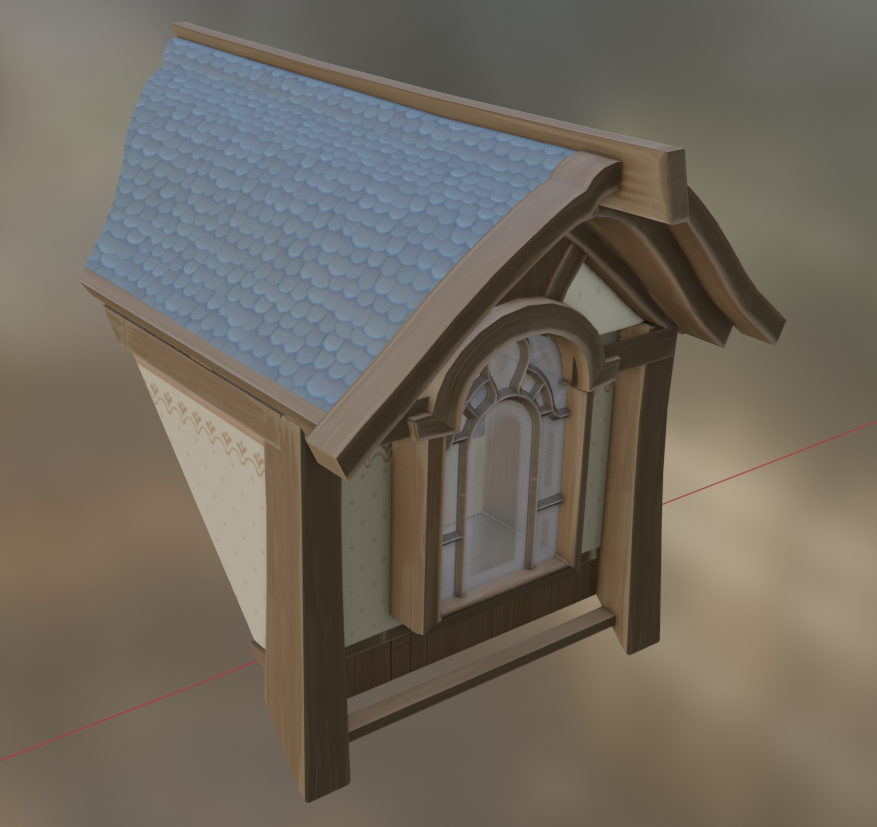

---

## Decor and rewards

### Flowers and bushes are coming

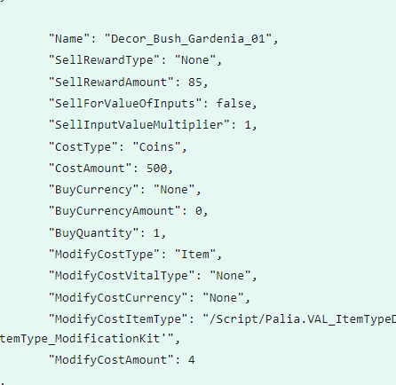

### More referral rewards

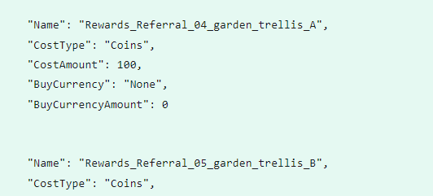

### Plantable trees of various sizes

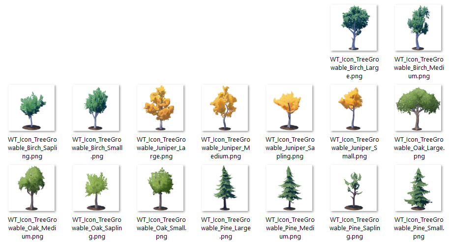

### Discord rewards

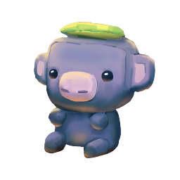 

⠀

⠀

⠀
