# 0.177.1 

## New map: **AZ2** in the **Umbraa** region

Theorized name candidates:  **Ancient Forest**, **Elderwoods**, **Umbraan Wilds**.

This map is heavily unfinished. It's half empty, uses placeholder structures, has already changed in the past and will probably still change. It doesn't represent the final look of the zone.

 

<video src="./ancient-forest-walkthrough.mov" controls style="width: 100%"></video>

⠀

### Map size in perspective

<video src="./ancient-forest-scale.mov" controls style="width: 100%"></video>

⠀

### Landscape vs working draft

  

⠀

### New ore: **Illuminium**

 

⠀

### New fish, bugs and forage

- Forage
  - Elderflower
  - Elderwood Lotus
  - Elderwood Orchid
  - Fern Fiddlehead
  - Kopaa bush
  - Waterflower
  - FLOWTATO 😂
  - Mushrooms
    - Floatfish mushroom
	- Baby clam, Elder clam shroom
	- Staircase mushroom
  - Black pearl
  - Beehive and Honey

- Bugs
  - Butterfly: Dayshadow butterfly, Moth Kitsuu, Cottonhop butterfly, Vampire butterfly,
  - Beetle: Blood beetle, Banshee beetle, Draugr beetle, Shadvaraak
  - Moth: Hummingbird moth, Whispering Widow, Witch's Eye
  - **Piksii**: Brightshroom piksii, Flame piksii, Zephyr piksii, 
  - Grasshopper: Flamehorned rockhopper, Floating Lantern rockhopper, Grumpy Granite rockhopper, Pumpkin rockhopper,
  - ...and more

- Fish
  - Gouramis Grim, 
Sabertoothed anchvoy, Elderwood betta, Halfmoon betta, Umbraan betta, Flounder Fluttering, Nova Bitterling, Ancient Eel, Lightrail, Majiri of War, Midnight floatfish, Moon floatfish, Piksii floatfish, Toadstool floatfish, Umbraan floatfish, Dappled Discus, Frillyfin, Ancient Koi, 
Brightshroom Oranda, Inyrevn Mermaid, Mullet Minnow...
  - **Sharks**: Elder shark, River shark
  - ...and more

- Hunting: **Fungopher**

⠀

---

⠀

## Earth temple: **Vault of the Roots**

This is also not final. Large parts of the temple are still missing decoration and prop clutter; the pipe section is only roughly blueprinted and uses placeholder chest assets.

<video src="./earth-temple.mov" controls style="width: 100%"></video>
<video src="./earth-temple-2.mov" controls style="width: 100%"></video>

⠀

### Earth bundle

**Reward: Ancient Galdur Statue** (GaldurSeedMaker)

> This bears the face of a familiar friend. At least this version is less talkative... for now

- Prospector’s Pal Bundle (**reward: Phoenix Flooring**)
  - Emerald
  - Jasper
  - Gold Bar (3)
  - Palium bar (20)

- Creatures of the Abyss Bundle (**reward: Galdur Bobber**)
  - Stonefish
  - Hypnotic Moray
  - Ancient Amber Beetle
  - Leafstalker Mantis

- Fruits of the Earth Bundle (**reward: recipe - Stuffed Tomatoes**)
  - Muujin Bahari
  - Bacon-Stuffed Mushrooms
  - Apple (100)
  - Brightshroom (20)

- Rootseeker's Bundle (**reward: recipe - Phoenix Floor Planter**)
  - Rootseeker Medallion (6)

### Reward: **Ancient Galdur Statue** ("Galdur seed maker")

 

⠀

### Reward: **Galdur bobber**

 

⠀

---

⠀

## New NPC: **Ulfe**

Also known as "the Umbraan child", "the lost child".

  

⠀

---

⠀

## Housing addons

### Courtyard

⠀

### Dormer window (goes on the roof)

⠀

---

⠀

## Decor and rewards

### Flowers and bushes are coming

⠀

### More referral rewards

⠀

### Plantable trees of various sizes

⠀

### Discord rewards

 

⠀

---
---

⠀

# In older versions

Unreleased assets from before 0.177.x

⠀

### Enemy faction: **The Darken** (id=1)

"The Darken" seem to be the "echoes", "shadows" sometimes mentioned in lore pieces. This faction is hostile to players (id=2).

⠀

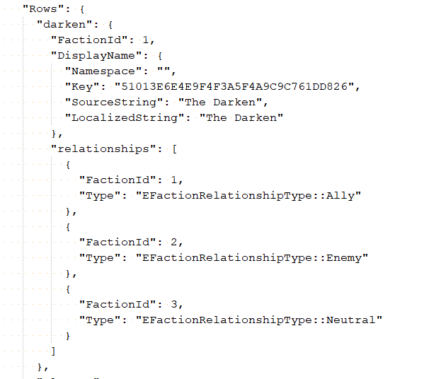

⠀
---

⠀

## New map: **Community Center**

<video src="./community-center.mov" controls style="width: 100%"></video>

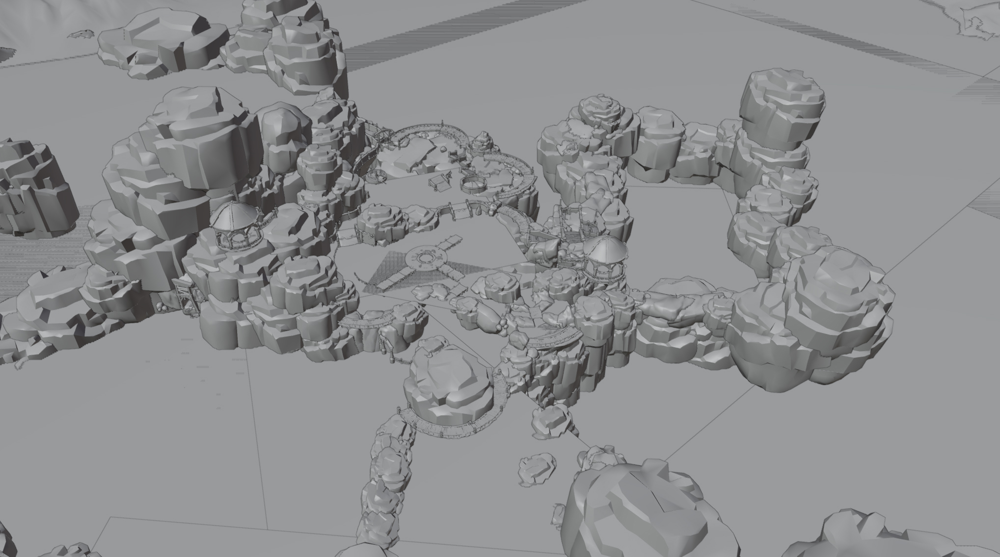

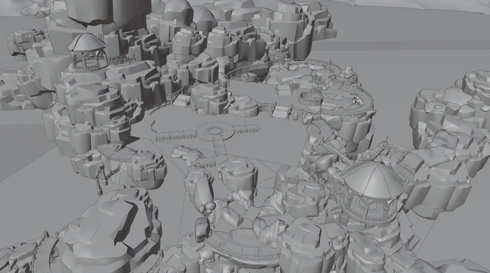

⠀

---
⠀

## Community activities

This is what the board in the center of Kilima is supposed to do.
⠀
⠀
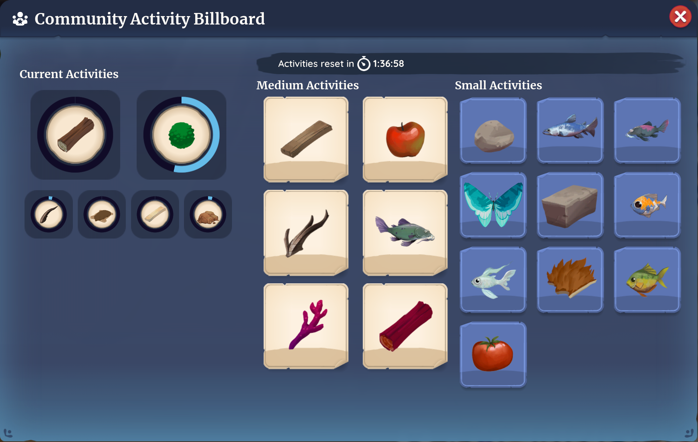

⠀

---

⠀

## Unused Fire Temple levels

These could have been scrapped in playtesting, or may be used later. who knows.
⠀
⠀
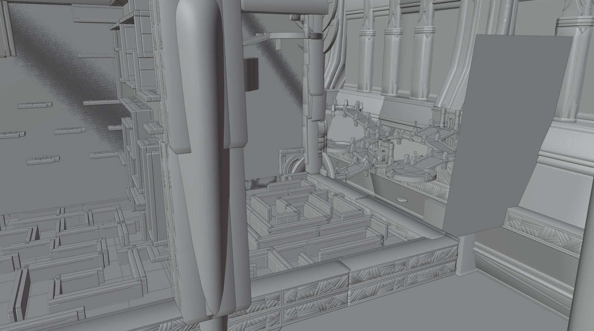

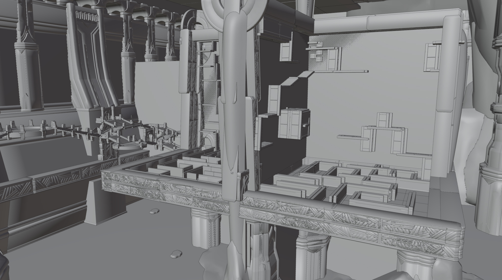

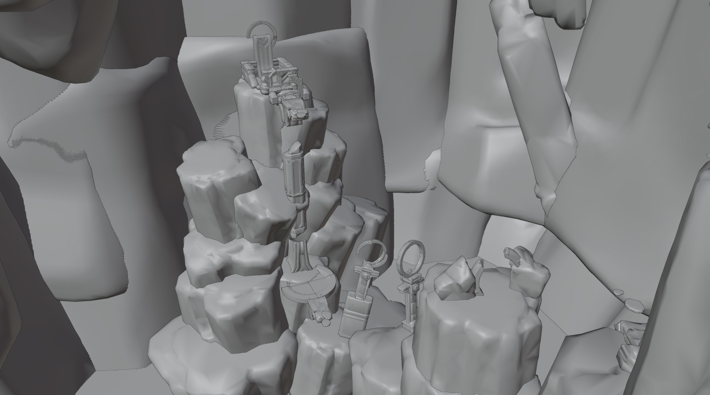

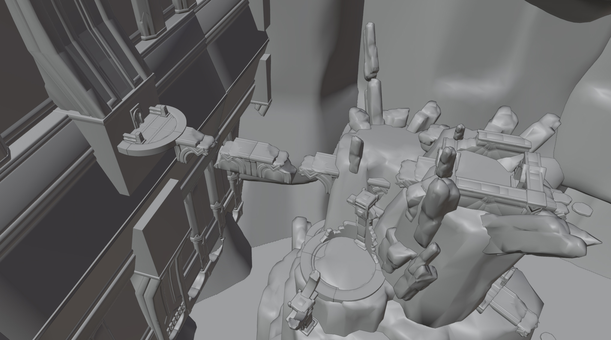

⠀

---

⠀

## New hunting creature codename **Beach walker**

It spits a goo that slows players down.

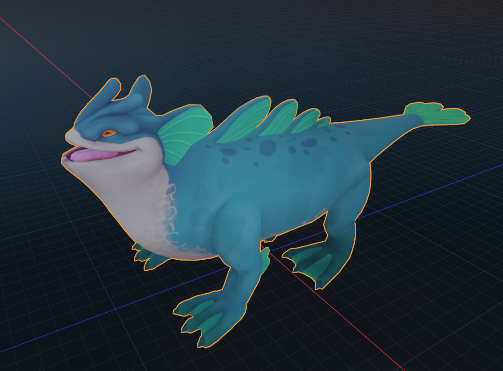

⠀

---

⠀
## Old Air temple concept

Air temple used to have extensive climbing sections. This was most likely removed because of negative feedback about the climbing tower challenge.

The floating tubes are spinning boulders, the rectangular platforms are moving platforms.

<video src="./old-air-temple-1.mov" controls style="width: 100%"></video>
<video src="./old-air-temple-2.mov" controls style="width: 100%"></video>
<video src="./old-air-temple-3.mov" controls style="width: 100%"></video>
⠀

---

⠀
## Old AZ2 concept

This area is almost entirely remade in the current version of AZ2.

<video src="./az2-wip-1.mov" controls style="width: 100%"></video>
<video src="./az2-wip.mov" controls style="width: 100%"></video>
⠀

---

⠀
## Majiri script

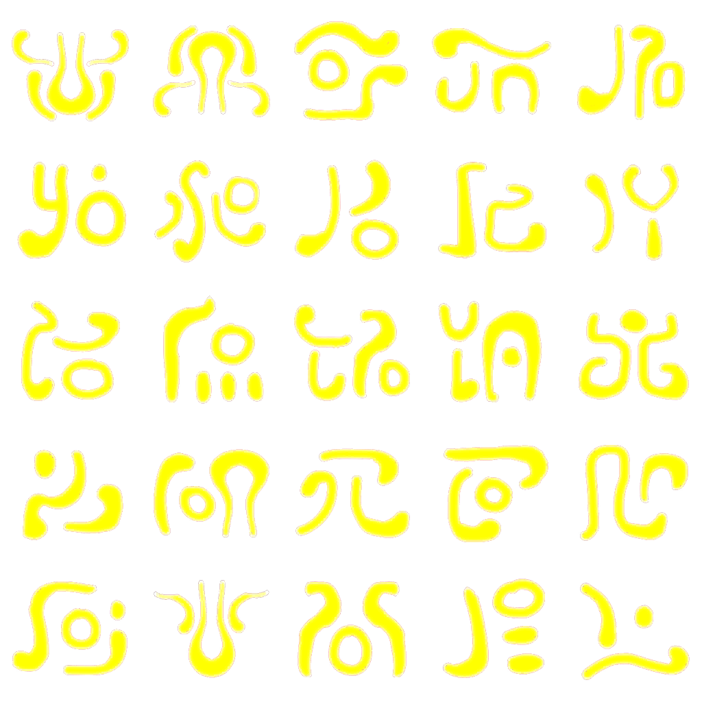

These playing cards have unknown purpose, but it appears to be digits in a base-12 system.

1 2 3 4
5 6 7 8
9 A B 0

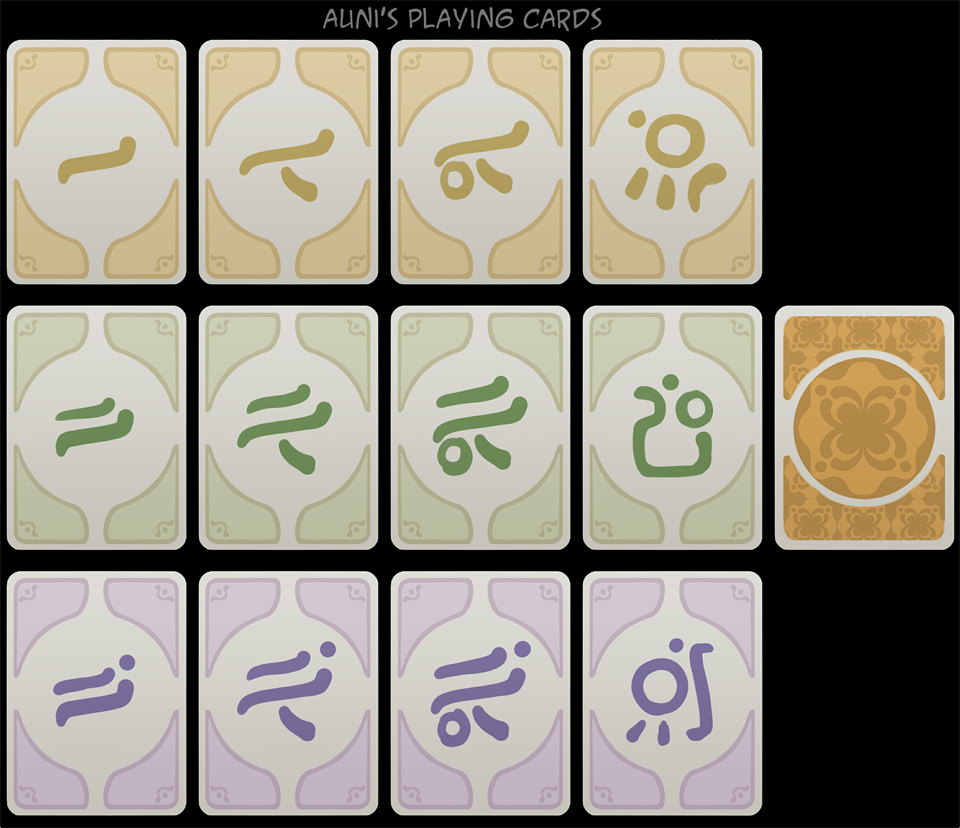
