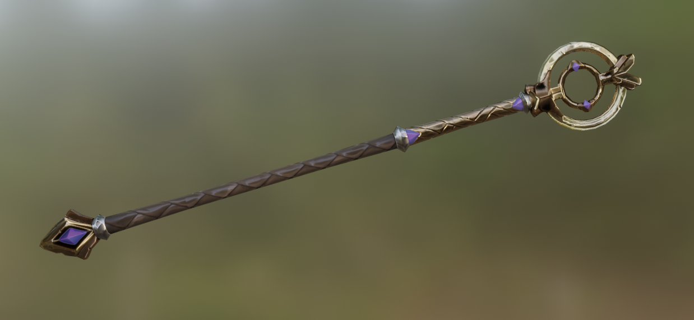
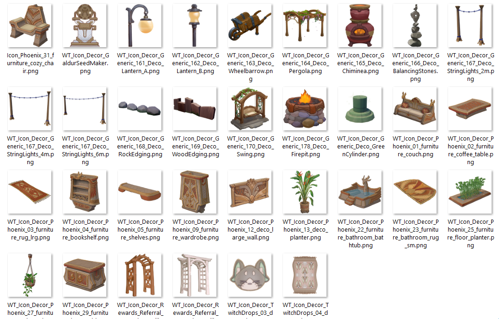

# 0.178

## AZ2 is **Elderwoods**

AZ2 has changed again. It now includes enough trees to be called Elderwoods.

This also hints that the [previous iteration of AZ2](#new-map-az2-in-the-umbraa-region), that included a fortress and a broken aqueduct, must have been a bad merge. Either Ancient Forest was scrapped in favor of Elderwoods, or these are two separate maps. 

 

<video src="./files/elderwood_mapspin.mov" controls style="width: 100%"></video>

⠀

### Beach walker coastline

This area includes a gazebo with a pier, and some static [Beach Walkers](#new-hunting-creature-codename-beach-walker). Possibly a setup for promotional renders?

<video src="./files/elderwood_beach.mov" controls style="width: 100%"></video>

⠀

### Mushroom caves

Mushroom caves are making a comeback in this verions of the game archive. 

<video src="./files/elderwood_cave.mov" controls style="width: 100%"></video>

⠀

### Abandoned villages

There are two different village-like areas in the map, with suspended walkways and buildings. The second area appears unfinished. It is safe to assume this is where we meet [Ulfe](#new-npc-ulfe). 

<video src="./files/elderwood_vllages.mov" controls style="width: 100%"></video>

⠀

### General landscape

Map is mostly filled with dense forests with occasional clearings. Moreover, there are multiple distinct structures that will most likely serve a gameplay purpose.

<video src="./files/elderwood_landscape.mov" controls style="width: 100%"></video>

⠀

---

⠀

## Combat update

**Staff of the Cosmos** is the final item unlocked by **completing Night Sky Temple bundles**. It's filed under "Combat" skill, but its purpose is so far unknown.

⠀

---

⠀

## New plants and decor

There's now a placeable green cylinder...

⠀

---

⠀

## Summer event

New summer event was spotted. Some of the activities involve competitions in gathering colorful shells, and treasure hunts. Not much more is known, other than that it takes place on a separate island map.

 

⠀

---

⠀

## Air temple map

A hand-drawn map of the Air Temple was added, with blue eggs required to progress the main quest clearly marked. 

 

⠀

---
---

⠀

# 0.177.1 

## New map: **AZ2** in the **Umbraa** region

Theorized name candidates:  **Ancient Forest**, **Elderwoods**, **Umbraan Wilds**.

This map is heavily unfinished. It's half empty, uses placeholder structures, [has already changed in the past](#old-az2-concept) and will probably still change. It doesn't represent the final look of the zone.

 

<video src="./files/ancient-forest-walkthrough.mov" controls style="width: 100%"></video>

⠀

### Map size in perspective

<video src="./files/ancient-forest-scale.mov" controls style="width: 100%"></video>

⠀

### Landscape vs working draft

 

 

⠀

### New ore: **Illuminium**

 

⠀

### New fish, bugs and forage

- Forage
  - Elderflower
  - Elderwood Lotus
  - Elderwood Orchid
  - Fern Fiddlehead
  - Kopaa bush
  - Waterflower
  - FLOWTATO 😂
  - Mushrooms
    - Floatfish mushroom
	- Baby clam, Elder clam shroom
	- Staircase mushroom
  - Black pearl
  - Beehive and Honey

- Bugs
  - Butterfly: Dayshadow butterfly, Moth Kitsuu, Cottonhop butterfly, Vampire butterfly,
  - Beetle: Blood beetle, Banshee beetle, Draugr beetle, Shadvaraak
  - Moth: Hummingbird moth, Whispering Widow, Witch's Eye
  - **Piksii**: Brightshroom piksii, Flame piksii, Zephyr piksii, 
  - Grasshopper: Flamehorned rockhopper, Floating Lantern rockhopper, Grumpy Granite rockhopper, Pumpkin rockhopper,
  - ...and more

- Fish
  - Gouramis Grim, 
Sabertoothed anchvoy, Elderwood betta, Halfmoon betta, Umbraan betta, Flounder Fluttering, Nova Bitterling, Ancient Eel, Lightrail, Majiri of War, Midnight floatfish, Moon floatfish, Piksii floatfish, Toadstool floatfish, Umbraan floatfish, Dappled Discus, Frillyfin, Ancient Koi, 
Brightshroom Oranda, Inyrevn Mermaid, Mullet Minnow...
  - **Sharks**: Elder shark, River shark
  - ...and more

- Hunting: **Fungopher**

⠀

---

⠀

## Earth temple concept

Compared to the released version, some side areas have become inaccessible, and the whole pipe maze section is missing.

<video src="./files/earth-temple.mov" controls style="width: 100%"></video>
<video src="./files/earth-temple-2.mov" controls style="width: 100%"></video>

⠀

---

⠀

## New NPC: **Ulfe**

Also known as "the Umbraan child", "the lost child".

  

⠀

---

⠀

## Housing addons

### Courtyard

⠀

### Dormer window (goes on the roof)

⠀

---

⠀

### More referral rewards

⠀

### Discord rewards

 

⠀

---
---

⠀

# In older versions

Unreleased assets from before 0.177.x

⠀

### Enemy faction: **The Darken** (id=1)

"The Darken" seem to be the "echoes", "shadows" sometimes mentioned in lore pieces. This faction is hostile to players (id=2).

⠀

⠀
---

⠀

## New map: **Community Center**

<video src="./files/community-center.mov" controls style="width: 100%"></video>

⠀

---

⠀

## Community activities

This is what the board in the center of Kilima is supposed to do.

⠀

---

⠀

## Unused Fire Temple levels

These could have been scrapped in playtesting, or may be used later. who knows.

⠀
⠀

⠀

---

⠀

## New hunting creature codename **Beach walker**

It spits a goo that slows players down.

⠀

---

⠀
## Old Air temple concept

Air temple used to have extensive climbing sections. This was most likely removed because of negative feedback about the climbing tower challenge.

The floating tubes are spinning boulders, the rectangular platforms are moving platforms.

<video src="./files/old-air-temple-1.mov" controls style="width: 100%"></video>
<video src="./files/old-air-temple-2.mov" controls style="width: 100%"></video>
<video src="./files/old-air-temple-3.mov" controls style="width: 100%"></video>

⠀

---

⠀

## Majiri script

A B C D E  
F G H I J  
K L M N O  
P Q R S T  
U V W X Y  

"Z" is not present in this tileset. It looks like this:

These playing cards have unknown purpose, but it appears to be digits in a base-12 system.

1 2 3 4  
5 6 7 8  
9 A B 0  

