# 0.190

## More Elderwood stuff

[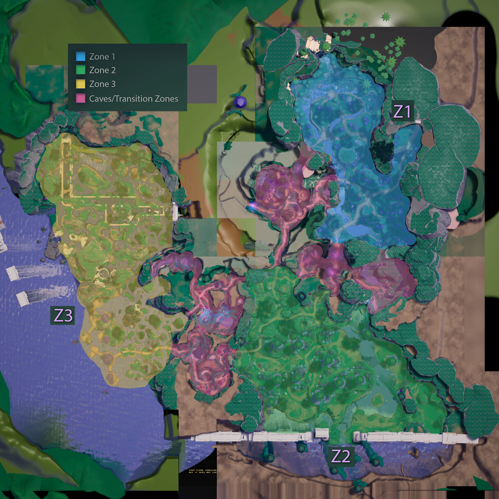](./files/190/elderwood-map.png)

⠀

## Artifacts

The three (3) Elderwood bundles will require assembling four (4) artifacts each.

[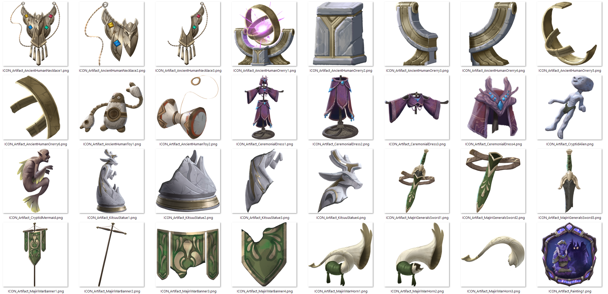](./files/190/artifacts.png)

⠀

---

⠀

## Updated areas

The map is still undergoing changes. This update mostly adds caves, and sprinkles more details in the existing surface level areas.

[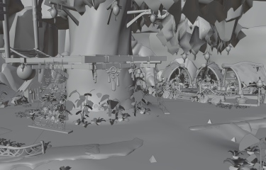](./files/190/elderwood-1.png)
[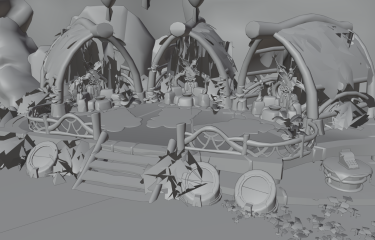](./files/190/elderwood-2.png)
[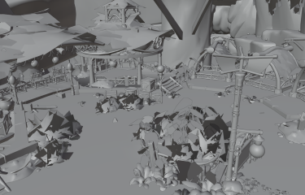](./files/190/elderwood-4.png)
[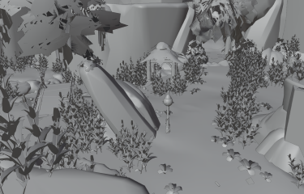](./files/190/elderwood-5.png)
[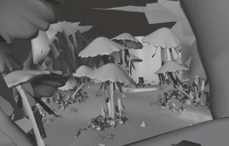](./files/190/elderwood-6.png)
[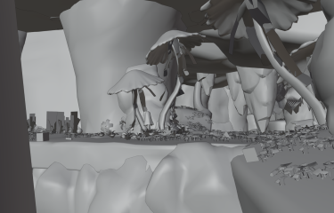](./files/190/elderwood-7.png)
[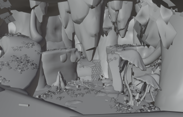](./files/190/elderwood-8.png)
[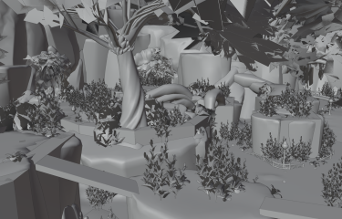](./files/190/elderwood-9.png)
[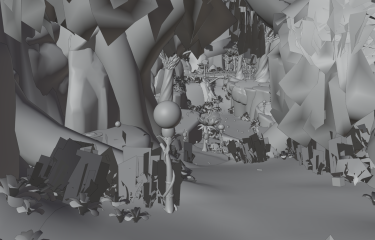](./files/190/elderwood-10.png)
[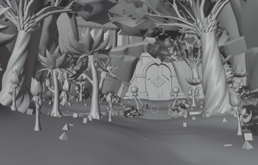](./files/190/elderwood-11.png)
[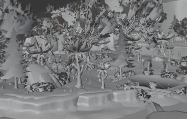](./files/190/elderwood-12.png)
[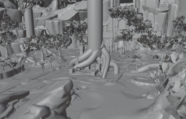](./files/190/elderwood-13.png)
[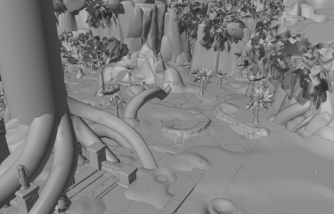](./files/190/elderwood-14.png)
[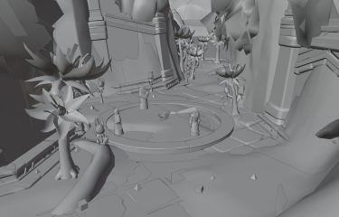](./files/190/elderwood-15.png)
[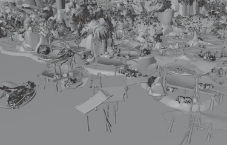](./files/190/elderwood-16.png)
[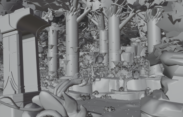](./files/190/elderwood-17.png)

⠀

### Barn

Barn.

[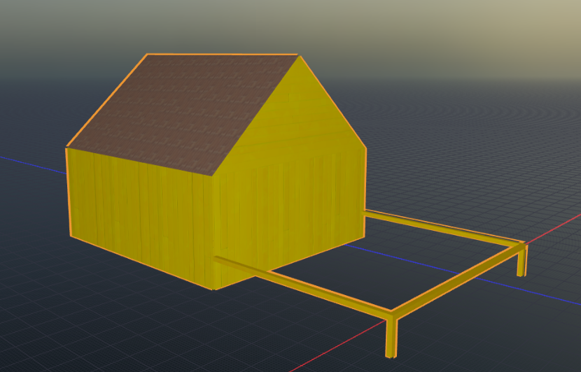](./files/190/barn.png)

⠀

### New materials

Spores, echo motes, Ogopuu meat and skin (yuck).

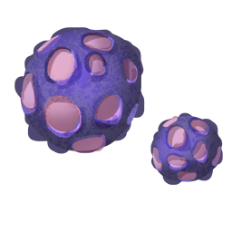

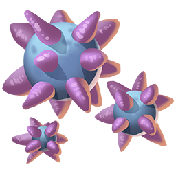

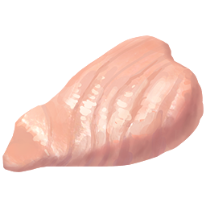
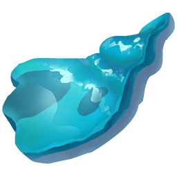

⠀

### Bee pet and even more stuffed animals...

For all the people who still haven't gotten bored of playing bootled Pokémon.

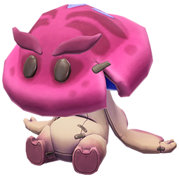
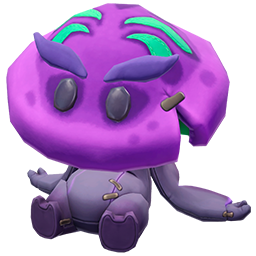
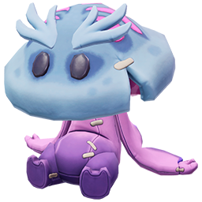

⠀

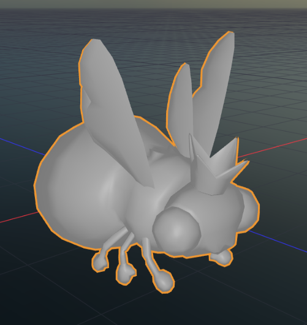

⠀

---
---

⠀

# 0.189

[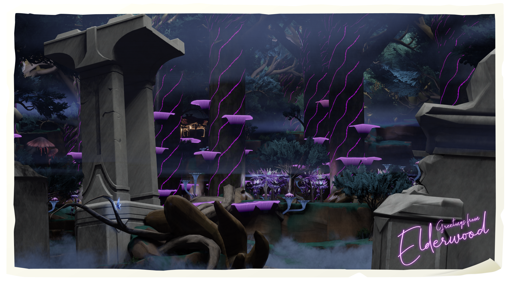](./files/189/elderwood.png)
*Rumours of my demise have been greatly exaggerated.*

⠀

---

⠀

## Greetings from **Elderwood**!

Elderwood, or AZ2, is mostly presentable in 0.189. There's still some placeholder assets and greybox blockouts, but the map looks about 90% complete now.

[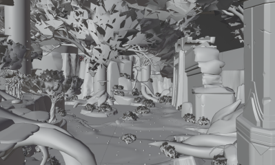](./files/189/elderwood-1.png)
[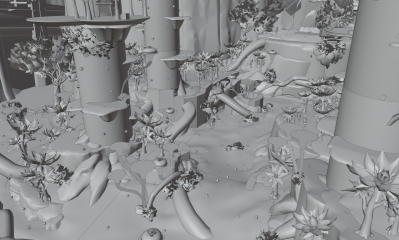](./files/189/elderwood-2.png)
[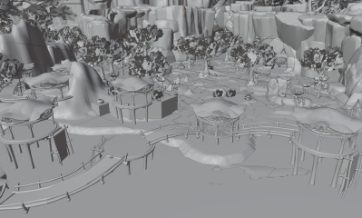](./files/189/elderwood-3.png)
[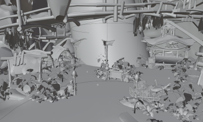](./files/189/elderwood-4.png)
[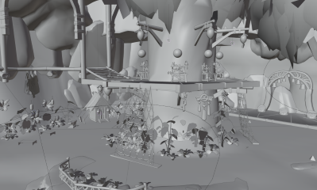](./files/189/elderwood-5.png)
[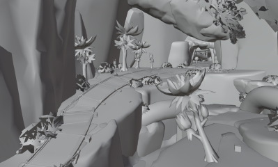](./files/189/elderwood-6.png)
[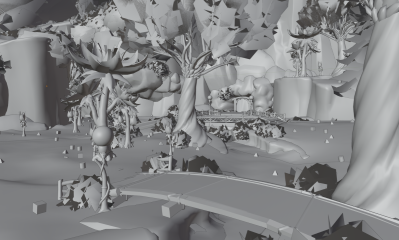](./files/189/elderwood-8.png)
[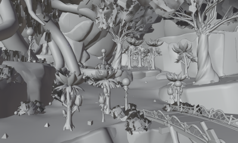](./files/189/elderwood-9.png)
[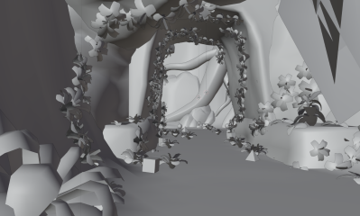](./files/189/elderwood-10.png)
[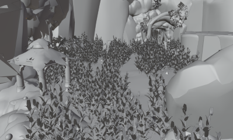](./files/189/elderwood-11.png)
[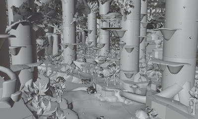](./files/189/elderwood-12.png)
[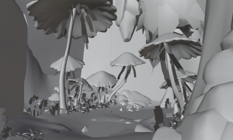](./files/189/elderwood-13.png)

⠀

### Size of Elderwood

AZ2 compared to the default housing plot.

[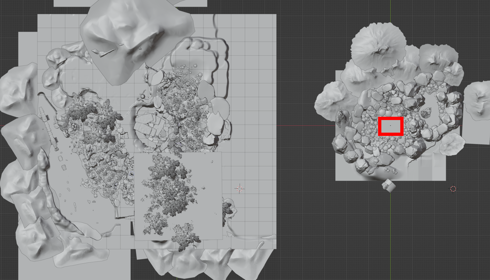](./files/189/elderwood-size.png) 

⠀

### Elderwood map

The zone has now undergone two different reworks since it was originally conceived. The current version is about 60% the size of [the original idea](#az2-is-elderwoods), and some areas are missing.

[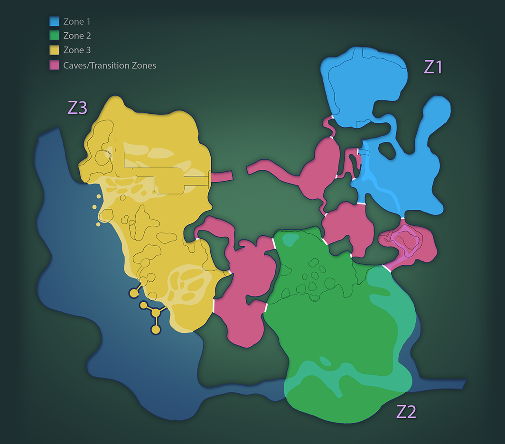](./files/189/elderwood-map.png) 

⠀

### Fauna of Elderwood

~17 new critters, ~23 new fish (including sharks), and a new huntable creature.

[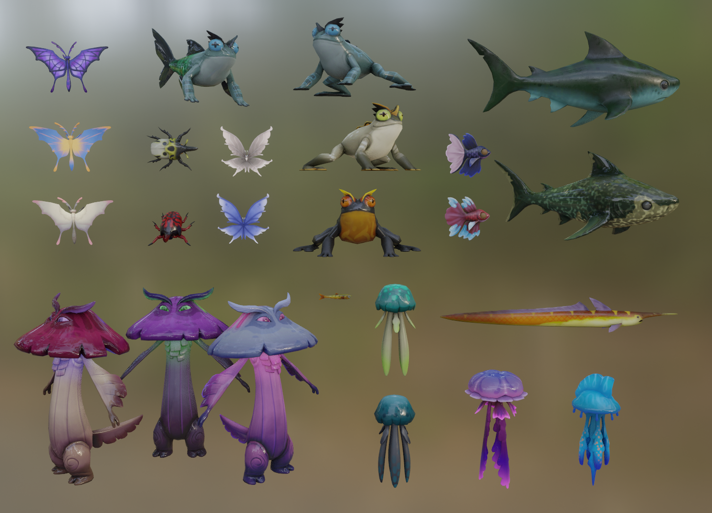](./files/189/elderwood-fauna.png) 

- Bugs
  - Butterfly: Dayshadow Batterfly, Kitsuu Moth, Cottonhop Batterfly, Vampire Batterfly,
  - Beetle: Blood beetle, Banshee beetle, Draugr beetle, Shadvaraak
  - Moth: Hummingbird Moth, Whispering Widow, Witch's Eye
  - **Piksii**: Brightshroom Piksii, Flame Piksii, Zephyr Piksii, 
  - Grasshopper: Flamehorned Rockhopper, Floating Lantern Rockhopper, Grumpy Granite Rockhopper, Pumpkin Rockhopper,

- Fish
  - Grim Gouramis, Sabertoothed Anchvoy, Fluttering Flounder, Bitterling Nova, Mullet Minnow
  - Elderwood Betta, Halfmoon Betta, Umbraan Betta
  - Ancient Eel, Lightrail
  - Majiri of War, Midnight Floatfish, Moon Floatfish, Piksii Floatfish, Toadstool Floatfish, Umbraan Floatfish
  - Dappled Discus, Frillyfin, Ancient Koi
  - Brightshroom Oranda, Inyrevn Mermaid...
  - **Sharks**: Elder Shark, River Shark

- Hunting:
  - **Fungopher**

⠀

---

⠀

## Next in: **Temple of the Cosmos**

In 0.189, the temple was updated with a long corridor leading to another set of closed doors. This is what lies beyond.

[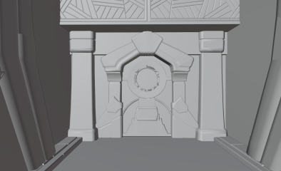](./files/189/cosmos-temple-1.png)
[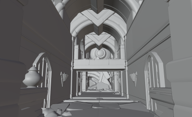](./files/189/cosmos-temple-2.png)
[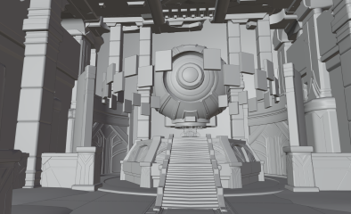](./files/189/cosmos-temple-3.png)
[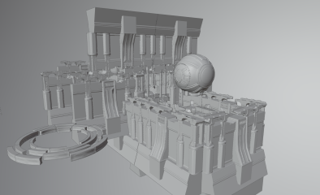](./files/189/cosmos-temple-4.png)
[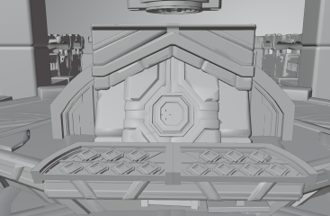](./files/189/cosmos-temple-5.png)
[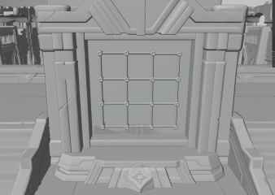](./files/189/cosmos-temple-6.png)

⠀

---
---

⠀

# INTERMISSION

Hey, I heard you like butterflies? Here's a map of all possible spawn locations of the elusive **Rainbow-Tipped Butterfly**. 

Be warned though, that those spawners can instead spawn one of the following: Common Blue Butterfly, Kilima Night Moth, Lunar Fairy Moth, Bahari Glowbug. And that will happen most of the time. So you'll still need a lot of luck. 

But at least now it's clear, once and for all, where the butterfiels dwell.

[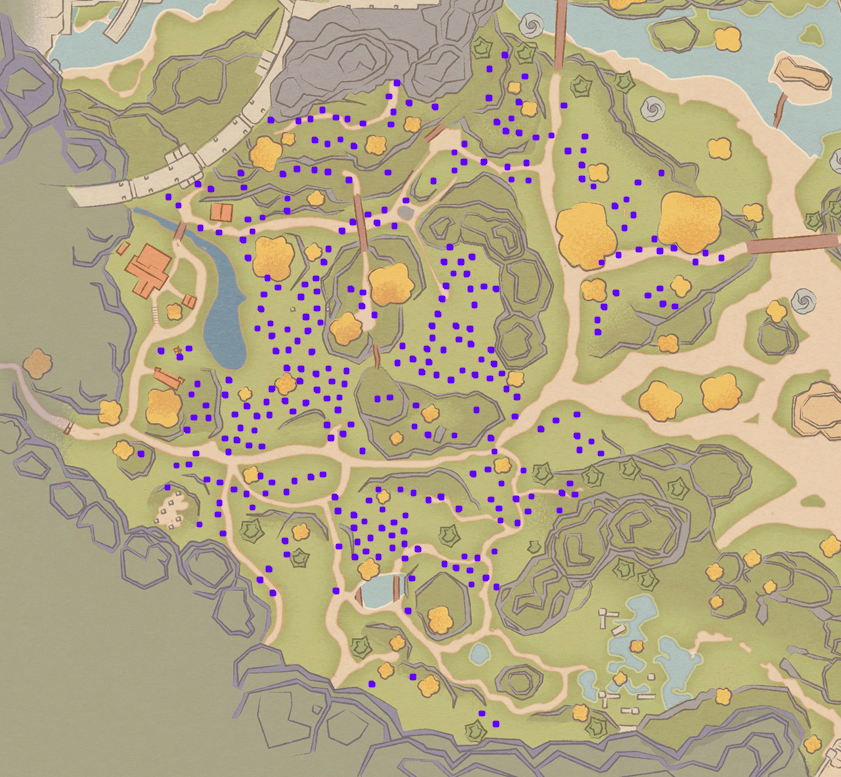](./files/189/rainbow-butterfly-spawns.png)

And now, back to regular programming.

⠀

---
---

⠀

# 0.181

⠀

## **Beach Walkers** are called **Ogopuu**

That one Elderwoods specific [hunting creature](#new-hunting-creature-codename-beach-walker) now has a confirmed name. They're called **Ogopuu** and drop scales.

⠀

---

⠀

## Summer event: ~~SCRAPPED~~

Gone, reduced to atoms.

⠀

---

⠀

## **AZ2**: what exactly is **Ghost Village**?

While **Elderwoods** is pretty much confirmed, this map file that aligns with the most recent look of [AZ2](#az2-is-elderwoods) was also spotted. But - confusingly, it's called "Ghost Village".

⠀

---

⠀

## New harvestable wood type and **Koppa** seeds

A new tree type exclusive to Elderwoods, and the associated materials.

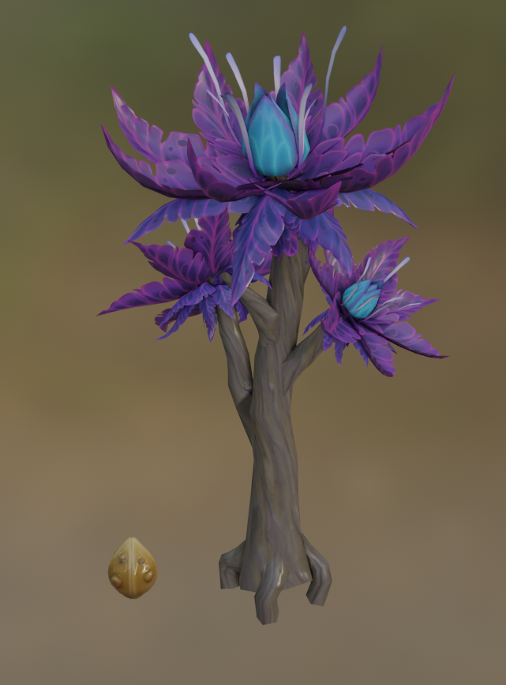

**Elderwood tree seed**, **Elderwood plank**, and **Elderwood wood** (how much wood could a woodchuck chuck).

  

⠀

---

⠀

## Housing: **Pool**

This model uses placeholder textures for now and will most likely look better.

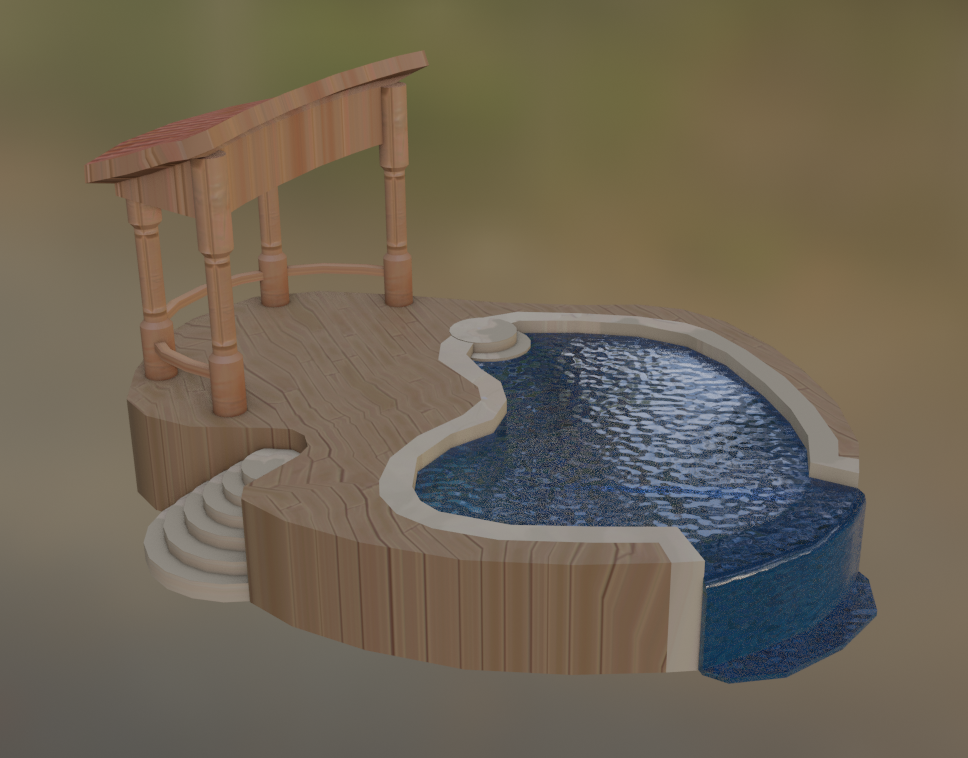

⠀

---

⠀

## Old Alpha maps

There's still some remnants of how old Alpha maps used to look like in the game files. Take a look and see if you can spot the differences (click to enlarge).

 

 

 

⠀

---
---

⠀

# 0.178

## AZ2 is **Elderwoods**

AZ2 has changed again. It now includes enough trees to be called Elderwoods.

This also hints that the [previous iteration of AZ2](#4th-map-ancient-forest), that included a fortress and a broken aqueduct, must have been a bad merge. Either Ancient Forest was scrapped in favor of Elderwoods, or these are two separate maps. 

 

<video src="./files/elderwood_mapspin.mov" controls style="width: 100%"></video>

⠀

### Beach walker coastline

This area includes a gazebo with a pier, and some static [Beach Walkers](#new-hunting-creature-codename-beach-walker). Possibly a setup for promotional renders?

<video src="./files/elderwood_beach.mov" controls style="width: 100%"></video>

⠀

### Mushroom caves

Mushroom caves are making a comeback in this verion of the game archive. 

<video src="./files/elderwood_cave.mov" controls style="width: 100%"></video>

⠀

### Abandoned villages

There are two different village-like areas in the map, with suspended walkways and buildings. The second area appears unfinished. It is safe to assume this is where we meet [Ulfe](#new-npc-ulfe). 

<video src="./files/elderwood_vllages.mov" controls style="width: 100%"></video>

⠀

### General landscape

Map is mostly filled with dense forests with occasional clearings. Moreover, there are multiple distinct structures that will most likely serve a gameplay purpose.

<video src="./files/elderwood_landscape.mov" controls style="width: 100%"></video>

⠀

---
---

⠀

# 0.177.1 

## 4th map? **Ancient Forest?**

This map was shipped in 0.177.x under `AZ2`, but it's different from the current AZ2. It's unknown if it was scrapped in favor of Elderwoods, or if it's indeed the 4th map. The rocky area in the back seems to just be a chunk merge error, and belongs to the current AZ2.

The map is half empty and uses placeholder pillar structures. It most likely doesn't represent the final look of the zone.

 

<video src="./files/ancient-forest-walkthrough.mov" controls style="width: 100%"></video>

⠀

### Map size in perspective

<video src="./files/ancient-forest-scale.mov" controls style="width: 100%"></video>

⠀

### Landscape vs working draft

 

 

⠀

### New ore: **Illuminium**

 

⠀

### New fish, bugs and forage

- Forage
  - Elderflower
  - Elderwood Lotus
  - Elderwood Orchid
  - Fern Fiddlehead
  - Kopaa bush
  - Waterflower
  - FLOWTATO 😂
  - Mushrooms
    - Floatfish mushroom
	- Baby clam, Elder clam shroom
	- Staircase mushroom
  - Black pearl
  - Beehive and Honey

⠀

---

⠀

## Earth temple concept

Compared to the released version, some side areas have become inaccessible, and the whole pipe maze section is missing. The final galdur-gardener area was also changed completely.

<video src="./files/earth-temple.mov" controls style="width: 100%"></video>
<video src="./files/earth-temple-2.mov" controls style="width: 100%"></video>

⠀

---

⠀

## New NPC: **Ulfe**

Also known as "the Umbraan child", "the lost child".

  

⠀

---

⠀

## Housing addons

### Dormer window (goes on the roof)

⠀

---
---

⠀

# In older versions

Unreleased assets from before 0.177.x

⠀

### Enemy faction: **The Darken** (id=1)

"The Darken" seem to be the "echoes", "shadows" sometimes mentioned in lore pieces. This faction is hostile to players (id=2).

⠀

⠀

---

⠀

## Community activities

This is what the board in the center of Kilima is supposed to do.

⠀

---

⠀

## Unused Fire Temple levels

These could have been scrapped in playtesting, or may be used later. who knows.

⠀
⠀

⠀

---

⠀

## New hunting creature codename **Beach walker**

It spits a goo that slows players down.

⠀

---

⠀
## Old Air temple concept

Air temple used to have extensive climbing sections. This was most likely removed because of negative feedback about the climbing tower challenge.

The floating tubes are spinning boulders, the rectangular platforms are moving platforms.

<video src="./files/old-air-temple-1.mov" controls style="width: 100%"></video>
<video src="./files/old-air-temple-2.mov" controls style="width: 100%"></video>
<video src="./files/old-air-temple-3.mov" controls style="width: 100%"></video>

⠀

---

⠀

## Majiri script

A B C D E  
F G H I J  
K L M N O  
P Q R S T  
U V W X Y  

"Z" is not present in this tileset. It looks like this:

These playing cards have unknown purpose, but it appears to be digits in a base-12 system.

1 2 3 4  
5 6 7 8  
9 A B 0  

